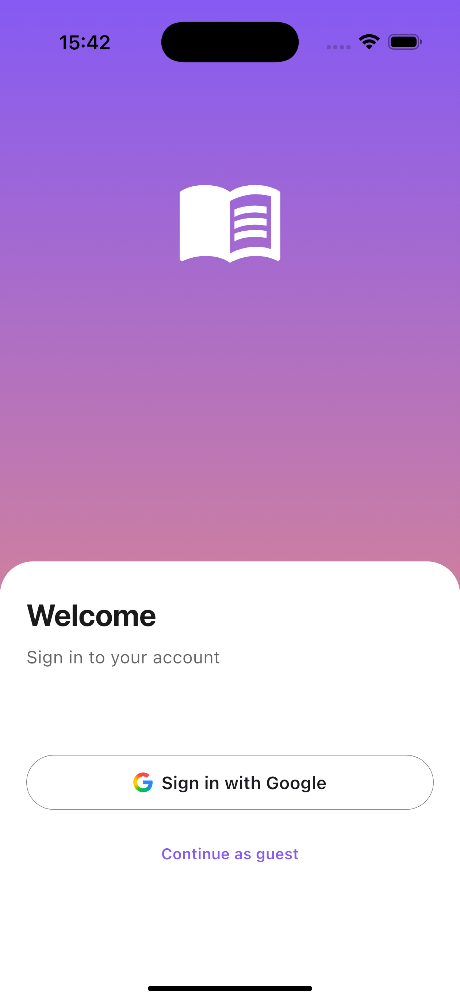
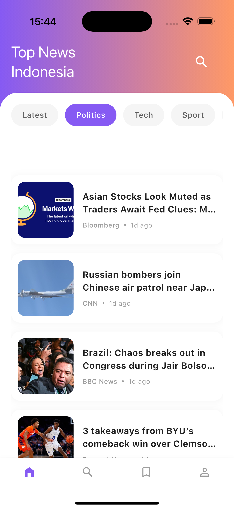
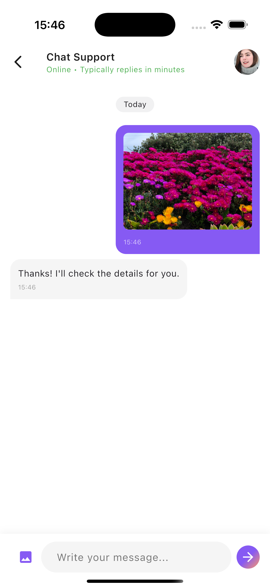

# Newsflow

A modern news application that aggregates top headlines from Indonesia. It features user
authentication, offline caching, bookmarking, and a chat support bot.

## Project Overview

This application allows users to:

* **Authenticate** via Google Sign-In or Guest Login.
* **Browse News** by category (Politics, Tech, Sports, etc.).
* **Read Offline** using local caching.
* **Chat** for support.
* **Bookmark** articles for later reading.

## Screenshots

|                     Login                     |                  News Feed                  |                        News Detail                        |                    Chat                     |
|:---------------------------------------------:|:-------------------------------------------:|:---------------------------------------------------------:|:-------------------------------------------:|
|  |  |  |  |

## Installation

**Prerequisites:**

* **Flutter Version:** 3.10.1 or higher.
* **Dart Version:** 3.0.0 or higher.

**Steps:**

1. **Clone the repository:**
   ```bash
   git clone https://github.com/sunmorphy/NewsFlow.git
   cd newsflow
   ```

2. **Install Dependencies:**
   ```bash
   flutter pub get
   ```

## Run Instructions

**To run the app on an emulator or device:**

```bash
flutter run
```

## Folder Structure

The project follows a scalable **GetX** architecture, separating Data, Features (Modules), and UI to
ensure maintainability and readability.

```text
lib/
├── data/
│   ├── local/          # SQLite database helpers & entity models
│   ├── remote/         # API services & JSON response models
│   └── repository/     # Logic to switch between Remote & Local data sources
├── modules/            # Feature-based folders (Controller and View)
│   ├── auth/           # Login Logic & View
│   ├── news/           # Home & Detail Views
│   ├── chat/           # Chatbot Feature
│   ├── bookmark/       # Saved Articles
│   └── dashboard/      # Bottom Navigation Wrapper & Tab Management
├── routes/             # App navigation routing
├── utils/              # Theme, Colors, and Constants
├── widgets/            # Global reusable widgets
└── main.dart           # App Entry Point & Initialization
```

## Implemented Features

* **Social Media Login**. Secure Firebase Authentication using Google Sign-In and Guest Login.
* **News Feed**. Fetches and displays top headlines with a category filter (Politics, Tech, etc.).
* **News Detail**. A dedicated view for reading full articles, featuring cover images and author
  metadata.
* **Chat Support**. A functional simulated chatbot interface allowing users to send text and images.
* **SQLite Database**. Local storage implementation for User sessions, News caching, and Chat
  history.
* **Offline Mode**. The app remains fully functional (browsing cached news & viewing chat history)
  without an internet connection.
* **Bookmarks**. Save articles to a local Bookmarks tab and search through them.
* **Integration Tests**. Automated testing coverage verifying the core user flow (Login -> News ->
  Chat).

## Testing Instructions

Ensure you have an Android Emulator or iOS Simulator running.

```bash
flutter test integration_test/app_flow_test.dart
```

## Additional Notes

* **Offline Mode**. To test offline mode, first load the news feed while connected to the internet.
  Then, turn on "Airplane Mode" on your device. The app will automatically serve the stored data
  from SQLite.
* **Emulator Constraints**. Ensure the emulator used has Google Play Services installed to support
  Google Sign-In.
